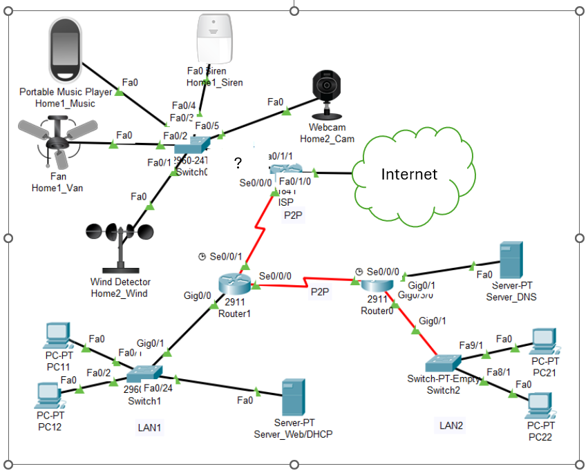

# NSVS_Projekt_S4
# Workflow

Schritt 1: Lese Info.txt.

Da bei Packet Tracer keine fortschritt als commit abgespeichert werden kann, muss eine Schritt für Schritt Doku mitgegeben werden.
Jeder Server und Router bekommte eine eigene .txt wo jeder Schritt bzw Befehl vermerkt wird.
siehe /config

---
# Projekt: Netzwerkplanung und -dokumentation

## Aufgabenstellung
Die Firma **YUPP Software Entwicklung GmbH** hat ein rasantes Wachstum hinter sich und siedelt mit dem Hauptsitz auf einen neuen Campus in zwei Gebäude um. Zusätzlich sollen in einer weit entfernten Lagerhalle am Stadtrand verschiedene Internet-of-Things (IoT) Überwachungselemente aufgestellt werden.

Für diesen Zweck soll ein Firmennetzwerk (bzw. Teile daraus als Prototyp) projektiert und eine Dokumentation darüber angefertigt werden. Weiters sollen grundlegende Netzwerkfunktionen sichergestellt und Sicherheitsüberlegungen angestellt werden.

---

## Spezifikationen

### 1. Logisches Netzwerk
* **Adressierung:** Die IP-Adressen sollen in den angegebenen Bereichen verteilt und mittels **Subnetting** unter Verwendung von **VLSM** in unterschiedlich große Netze aufgeteilt werden.
* **IP-Zuweisung:** Alle Arbeitsstationen müssen ihre IP-Adressen **automatisch** beziehen (DHCP).
* **Adressbereich:** Im gesamten Netzwerk werden **private Adressen** verwendet.
* **Implementierung:** Router, Switches und Endgeräte sind für einen funktionstüchtigen Prototypen korrekt zu konfigurieren.

### 2. Switching
* **Struktur:** Die verschiedenen Netzwerke (PCs-LANs und Server-LANs) sind logisch in **VLANs** zu strukturieren.
* **Konfiguration:** Erforderliche Switches, VLANs und Trunks müssen eingerichtet werden.
* **Sicherheit:** Ein besonderes Augenmerk ist auf die **LAN-Security** zu legen.

### 3. WAN-Anbindung
* **Internet:** Die Anbindung erfolgt am Campus. Ein öffentlicher IP-Adressbereich wird vom ISP bereitgestellt (bzw. muss angefordert werden).
* **NAT/PAT:** Für die Internetanbindung ist die Implementierung von NAT/PAT am Border Router erforderlich.
* **Web-Service:** Zu Testzwecken soll ein Web-Service im Internet bereitgestellt werden (Hinweis: Nur offizielle Adressen routen!).

### 4. IoT und IoT-Server
* **Anbindung:** Der Standort Lagerhalle muss an den Campus angebunden werden.
* **Registrierung:** IoT-Elemente (mit privaten IP-Adressen) müssen auf einen zentralen **IoT-Registration-Server** zugreifen können.
* **Zugriffsbeschränkung:** * Der Server kann auf einem beliebigen Host aktiviert werden.
    * **Exklusivrecht:** Nur **PC22** ist berechtigt, auf den IoT-Server zuzugreifen und die Daten der IoT-Elemente einzusehen.

    
    
## Infos zur Dimensionierung

Das Netzwerk wird basierend auf folgenden Kapazitäten geplant:

| Bereich | Anzahl der Einheiten | Beschreibung |
| :--- | :--- | :--- |
| **LAN 1** | X1 Beschäftigte | Abteilung Produktion |
| **LAN 2** | X2 Beschäftigte | Abteilung Office |
| **IoT** | X3 Elemente | Lagerhalle / Überwachung |

### IP-Adressplanung
* **Interner IP-Adressbereich:** [10.31.0.0/16]
* **Öffentlicher IP-Adressbereich:** X.X.X.X / [Subnetzmaske]

---

## ToDos

### 1. Dokumentation
Es ist eine vollständige Dokumentation über das projektierte Firmennetzwerk zu erstellen, die folgende Punkte umfasst:
* **Netzdiagramm:** Visuelle Darstellung der Topologie (Campus, Lagerhalle, Internet-Edge).
* **Bandbreitenbedarf:** Analyse und Auslegung der benötigten Kapazitäten.
* **IP-Schema:** Detaillierte Tabelle der Subnetze (VLSM-Planung).
* **VLAN-Schema:** Zuordnung der IDs, Namen und Ports.
* **Security:** Dokumentation der Sicherheitsmaßnahmen (ACLs, LAN-Security, NAT/PAT).

### 2. Prototyping
* Erstellung eines funktionsfähigen Prototypen in **Cisco Packet Tracer**.
* Nachweis der Konnektivität (Routing & Switching).
* Verifizierung der Zugriffsregeln (IoT-Server Zugriffsbeschränkung).
